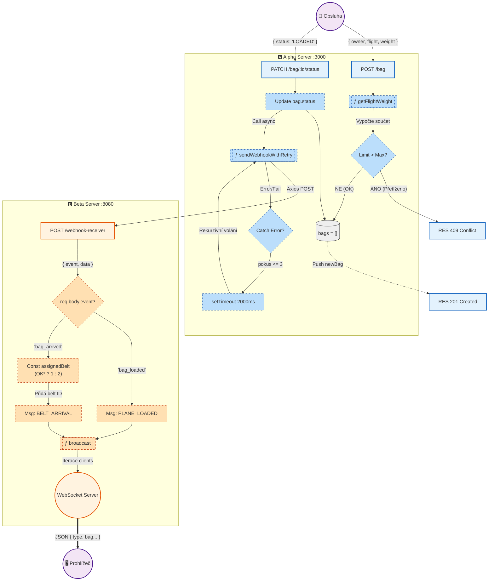

# ✈️ Airport Baggage Handling System


## 📋 Přehled architektury

Systém je rozdělen na dvě nezávislé aplikace, které spolu komunikují v reálném čase.

### 1. Alpha Server (Check-in & Logic Provider)
* **Role:** Zdroj pravdy (Source of Truth), REST API, Business logika.
* **Technologie:** Node.js, Express, Axios.
* **Zodpovědnost:**
    * Odbavení zavazadel (Check-in).
    * Validace hmotnostních limitů letadel (Business Logic).
    * Notifikace externích systémů pomocí **Webhooků**.
    * Robustní odesílání dat s mechanismem **Opakovaného doručení (Retry pattern)**.

### 2. Beta Server (Display & Notification Hub)
* **Role:** Agregátor událostí, Real-time notifikace klientů.
* **Technologie:** Node.js, Express, WebSocket (`ws`).
* **Zodpovědnost:**
    * Příjem Webhooků od Alphy (`/webhook-receiver`).
    * Transformace dat pro koncové klienty (přiřazování pásů pro výdej).
    * **WebSocket server** pro okamžitou aktualizaci informačních tabulí (Frontend).

---

## 🛠 Popis netriviálních mechanik a Business Logic

Projekt splňuje požadavky na pokročilou logiku a přidanou hodnotu nad daty následujícími způsoby:

### A. Retry Pattern (Netriviální mechanika)
Komunikace mezi servery není vždy spolehlivá. Alpha server implementuje **rekurzivní retry mechanismus** při odesílání webhooku.
- Pokud je Beta server nedostupný, Alpha se nevzdává okamžitě.
- Pokusí se o doručení znovu (maximálně 3x) s časovým odstupem (backoff 2000ms).
- **Kde to najdete:** Funkce `sendWebhookWithRetry` v `alpha-server.js`.

### B. Validace přetížení letadla (Business Logic)
Systém není pouhým úložištěm dat. Při každém požadavku na odbavení (`POST /bag`) se dynamicky vypočítává aktuální zátěž konkrétního letu.
- Pokud by nový kufr způsobil překročení limitu (např. 100 kg pro let OK123), systém požadavek zamítne (`409 Conflict`).
- **Kde to najdete:** Endpoint `/bag` a objekt `FLIGHT_LIMITS`.

### C. Inteligentní routing zavazadel (Data Enrichment)
Beta server pouze nepřeposílá data, ale obohacuje je. Při události `bag_arrived` analyzuje číslo letu:
- Lety začínající na `OK` -> Pás č. 1.
- Ostatní lety -> Pás č. 2.
- Tato logika se děje na backendu Bety a frontend dostává již hotovou informaci.

---




## 📡 API Dokumentace

### Alpha Server (Port 3000)

#### `POST /bag` - Odbavení kufru
Vytvoří nový kufr, pokud to kapacita letu dovolí.
```json
// Request
{
  "owner": "Jan Novak",
  "flight": "OK123",
  "weight": 20
}